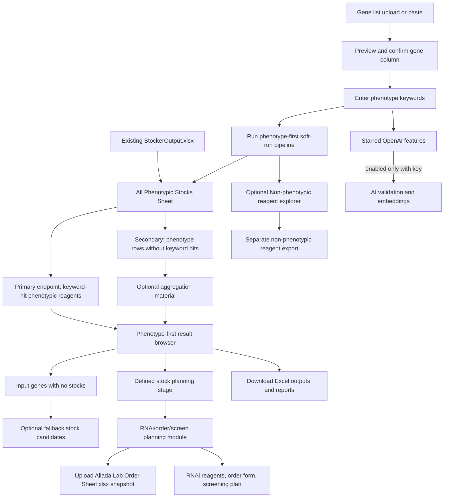

# 02. User Flow and Screens

## High-Level Flow

## Screen List

1. **Home / Setup Check** — FlyBase data status, OpenAI availability, locked
   premium features visibly starred.
2. **Gene Input** — CSV upload primary; pasted symbols fallback. Auto-detect
   gene column with a single confirmation step. Per-run workspace created
   under `runs/<timestamp>/`.
3. **Phenotype Keywords and Simple Priorities** — Default keywords selected,
   plain-language reagent priority cards, hidden raw JSON, live count preview
   showing which settings filter vs sort.
4. **Run Pipeline** — Phenotype-first soft-run by default; OpenAI features
   starred and disabled without an API key. Live progress with friendly steps
   and a captured log panel.
5. **Phenotype-First Results Browser** — Tabs in priority order:
   `Keyword Hits`, `No Keyword Hits`, `Input Genes Needing Fallback`,
   optional fallback stock candidates.
   - **5b. Non-Phenotypic Reagent Explorer** — Opt-in secondary view over the
     Stage 1 `Gene Reagent Index` for input-gene reagents with no curated
     phenotype row. Strictly separate from phenotype views and exports.
6. **Stock Planning Stage** — User-defined priorities applied; duplicates
   folded with audit; per-gene/per-reagent limits enforced; counts visible.
7. **Downloads** — Two primary final workbooks plus
   `gene_schema-flowchart.png`, plus audit/secondary downloads.
8. **RNAi Planning** — Launched from the phenotype browser; depends on an
   uploaded Allada Lab Order Sheet snapshot.
9. **Allada Lab Sheet Snapshot** — Single-file `.xlsx` upload step that gates
   screen planning; schema-tolerant parser.
10. **Lab-Sensitive Data Privacy** — Gitignore guardrails covering uploaded
    snapshots, project gene sets, and generated screen-planning outputs.

## Count Checkpoints (Visible Through The Run)

The user must be able to see, at every stage:

- Input genes
- Genes mapped to FlyBase IDs
- Genes with any stocks
- Genes with phenotype-backed reagents
- Genes with keyword-hit phenotype-backed reagents
- Total keyword-hit reagents
- Total no-keyword-hit phenotype reagents
- Final planning candidates after user limits
- Duplicate groups folded
- Already-in-lab matches
- Final order-form rows
- Final screening-plan rows

These are also the inputs to `gene_schema-flowchart.png` (see
[`08-schema-flowchart.md`](08-schema-flowchart.md)).

## Default Run Mode (No User Action Required)

- `Settings(soft_run=True, ...)`.
- OpenAI embeddings off.
- Keyword hit/no-hit grouping on.
- `run_functional_validation=False` in Stage 1.
- `run_validation=False` in Stage 2.
- Default split config:
  [`data/config/stock_split_config_no_bloomington.json`](../data/config/stock_split_config_no_bloomington.json).
