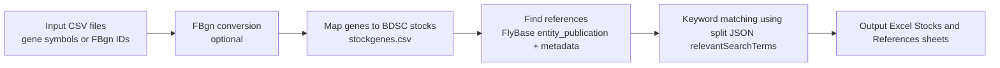
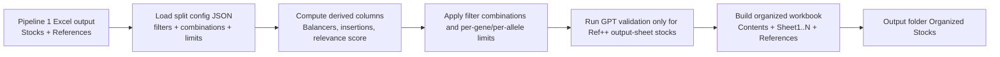

# fly_stocker_v2 Pipeline Usage

`fly_stocker_v2` has two CLI pipelines:

1. `get-allele-refs` (Pipeline 1): input gene lists -> BDSC stocks -> publication references
2. `split-stocks` (Pipeline 2): Pipeline 1 workbook -> JSON-driven stock sheet splits + Ref++-scoped GPT validation

## High-Level Data Flow

### Pipeline 1 (`get-allele-refs`)



### Pipeline 2 (`split-stocks`)



## Prerequisites

- Run commands from `Fly_Stock_Scrapers/FlyStocker/Core`.
- Install dependencies:
  - `pip install -r fly_stocker_v2/requirements.txt`
- Place input CSV files in one folder (example: `./gene_lists`).
- Optional environment variables:
  - `OPENAI_API_KEY`: required for GPT functional validation in Pipeline 2
  - `NCBI_API_KEY`: recommended to reduce PubMed rate limits
  - `UNPAYWALL_TOKEN`: optional full-text retrieval token

---

## CLI Quick Start

```bash
# Pipeline 1: build Stocks + References workbook
python -m fly_stocker_v2.cli get-allele-refs ./gene_lists

# Pipeline 2: split/organize stock sheets and run Ref++-scoped validation
python -m fly_stocker_v2.cli split-stocks ./gene_lists/Stocks
```

With custom config:

```bash
python -m fly_stocker_v2.cli get-allele-refs ./gene_lists --config ./my_split_config.json
python -m fly_stocker_v2.cli split-stocks ./gene_lists/Stocks --config ./my_split_config.json
```

Default config path:

- `fly_stocker_v2/data/JSON/stock_split_config_example.json`

---

## Pipeline 1: `get-allele-refs`

Builds the base `Stocks` + `References` workbook from input gene CSV files.

### Required argument

- `input_dir`: directory containing CSV files.

### Options

- `--gene-col` (default: `flybase_gene_id`)
  - Column containing FBgn IDs after conversion.
- `--input-gene-col` (default: `ext_gene`)
  - Input symbol column used during FBgn conversion.
- `--config`, `-c`
  - JSON config path used to load `settings.relevantSearchTerms`.
- `--batch-size`, `-b` (default: `50`)
  - Batch size for pipeline processing.
- `--skip-fbgnid-conversion`
  - Use this when input CSVs already contain FBgn IDs.
- `--soft-run`
  - Accepted for interface parity; Pipeline 1 itself does not run GPT validation by default.
- `--test-log`
  - Enables GPT query logging if/when validation is active.
- `--max-gpt-calls-per-stock` (default: `5`)
  - Accepted parameter; effective only when GPT validation is run.

### Output

Creates:

- `./gene_lists/Stocks/aggregated_bdsc_stock_refs.xlsx`

Main sheets:

- `Stocks`
- `References`

---

## Pipeline 2: `split-stocks`

Consumes Pipeline 1 workbook(s), applies JSON-defined filter combinations, writes organized output sheets, then runs GPT functional validation only for selected Ref++ stocks.

### Required argument

- `input_dir`: directory containing Pipeline 1 Excel files.

### Options

- `--config`, `-c`
  - JSON split configuration path.
- `--quiet`, `-q`
  - Suppress verbose output.
- `--soft-run`
  - Stops before GPT API calls and prints predicted call counts.
- `--max-gpt-calls-per-stock` (default: `5`)
  - Cap on actual GPT calls per stock during validation.

### Validation scope (important)

Pipeline 2 does **not** validate every stock/reference pair. It validates only:

1. stocks that survive filters + limits into produced output sheets whose combination contains `Ref++`
2. `(stock, allele, PMID)` tasks where PMID is keyword-hit (`relevantSearchTerms`) and full text/pattern checks pass

Stocks in non-`Ref++` output sheets are not sent to GPT validation.

### Output

Creates:

- `./gene_lists/Stocks/Organized Stocks/`

For each input workbook, writes `<input_name>_aggregated.xlsx` containing:

- `Contents`
- `Sheet1`, `Sheet2`, ...
- `References` (filtered to PMIDs cited by stocks present in output sheets)
- `Stock Sheet by Gene` (when applicable)

---

## Split Config Reference (JSON)

The split config controls filtering, sheet definitions, and keyword logic.

Key sections:

- `settings.relevantSearchTerms`: case-insensitive title/abstract terms used for Ref++ status
- `settings.maxStocksPerGene`: per-gene cap applied in splitting
- `settings.maxStocksPerAllele`: per-allele cap applied in splitting
- `filters`: named filter definitions (`column`, `type`, `value`)
- `combinations`: ordered lists of filter names; each list becomes one output sheet
- `filterDescriptions`: human-readable text shown in workbook summaries

Example config:

- `fly_stocker_v2/data/JSON/stock_split_config_example.json`

---

## Notes on Soft Runs and GPT Call Limits

- `split-stocks --soft-run` prints projected validation counts and exits before GPT calls.
- `--max-gpt-calls-per-stock` counts only actual GPT invocations.
- References without accessible full text, or missing stock/allele/gene patterns in text, are marked ambiguous and do not consume GPT-call budget.
- Validation short-circuits per stock once a "Functionally validated" result is found.

---

## Full-Text Retrieval Notes

Functional validation uses a multi-source full-text cascade with identifier enrichment:

1. Resolve missing IDs (PMCID/DOI) from PMID using NCBI ID Converter, with Europe PMC as fallback.
2. Try PMCID-based sources:
   - PMC OA PDF
   - PMC OA XML
   - Europe PMC fullTextXML
   - PMC article HTML
3. Try DOI-based sources:
   - Unpaywall (PDF/HTML)
   - OpenAlex OA URL
   - Crossref links
   - DOI landing page

Additional behavior:

- A persistent PMID -> retrieval-method cache is used to retry known-good methods first.
- HTTP calls use transient-failure retries (`429/5xx`) with exponential backoff.
- Duplicate `References` rows with the same PMID are merged to prefer rows that include `PMCID`/`DOI`.
- Full-text misses are reported with reason codes (for example: `missing_pmcid_and_doi`, `all_sources_failed`) in validation logs.

---

## End-to-End Example

```bash
python -m fly_stocker_v2.cli get-allele-refs ./gene_lists --config ./my_split_config.json
python -m fly_stocker_v2.cli split-stocks ./gene_lists/Stocks --config ./my_split_config.json
```
