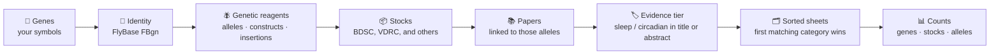
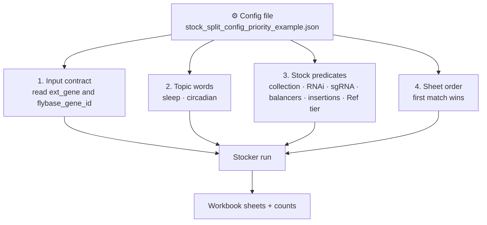

# How stocker works

Stocker is a *Drosophila* reagent-lookup tool. You give it genes. It returns the FlyBase stocks that perturb those genes, together with the papers attached to those stocks, sorted into experimental categories.

It does not invent stocks or interpret sleep biology. It organizes records that already exist in FlyBase and PubMed.

---

## At a glance

```
🧬 Gene list          🪪 Stable IDs         🪰 Reagents            📚 Literature           🗂️ Workbooks
   symbols      →        FBgn         →    alleles, RNAi,     →    titles & abstracts  →   sorted sheets
   you provide           FlyBase            insertions, stocks      PubMed                  + counts
```

| You provide | Stocker consults | You receive |
|---|---|---|
| One or more lists of gene symbols | FlyBase gene, allele, construct, insertion, stock, phenotype, and citation tables | One Excel workbook per gene list |
| A sorting rule file (the config) | PubMed titles and abstracts for those citations | A counts table: genes, stocks, and alleles per category |

---

## The scientific path



A single gene can map to many alleles. An allele can sit in many stocks. A stock can cite many papers. Stocker follows those links, then *places each stock in only one output sheet*: the first category it qualifies for.

---

## Inputs

**Gene lists.** Each list is a table with one gene symbol per row (`ext_gene`). After identity mapping, each row also has a FlyBase gene ID (`flybase_gene_id`, for example FBgn0032901). One list becomes one workbook. Two lists (for example two DEG contrasts) become two independent workbooks.

**The config file.** This is the sorting protocol, not a data source. Unless
you specify another file, use
[`data/config/stock_split_config_priority_example.json`](../data/config/stock_split_config_priority_example.json).
It does not add genes or stocks. It tells stocker *which columns to read*,
*what “topic-relevant” means*, and *in what order to bin reagents*.

Before running Stocker, convert symbols with `scripts/fetch_fbgn_ids.py`. The
helper leaves the original CSV untouched and writes `validated_<original>.csv`,
`validated_<original>.xlsx`, and `needs-review.csv`. A human must review the
workbook; run Stocker only on the validated CSV after that review. Unmatched
rows belong in FlyBase's ID converter, not in hand-filled IDs.

---

## Data stocker uses

```
        FlyBase                         PubMed
   ┌─────────────────┐            ┌──────────────────┐
   │  genes (FBgn)   │            │  title           │
   │  alleles        │──────────► │  abstract        │
   │  constructs     │  citations │  (keywords only) │
   │  insertions     │            └──────────────────┘
   │  stocks (FBst)  │
   │  stock center   │
   │  genotypes      │
   │  curated        │
   │  phenotypes     │
   └─────────────────┘
            │
            ▼
        stocker
```

| Source | What is taken from it | Why it matters experimentally |
|---|---|---|
| FlyBase gene / synonym tables | Current symbol and FBgn | The same gene is not missed because of an old CG number or synonym |
| FlyBase allele ↔ gene | Classical and transgenic alleles of that FBgn | These are the lesions or knockdown reagents |
| FlyBase constructs and insertions | UAS, RNAi, GAL4, sgRNA, landing sites | Distinguishes knockdown from CRISPR from other transgenes |
| FlyBase stocks | Orderable (and some custom) genotypes, collection name | This is what you can request from BDSC, VDRC, or another center |
| FlyBase stock components | Balancers, extra insertions | Flags genotypes that are harder to use as-is |
| FlyBase citations | Which papers are attached to an allele | Literature is scored at the *allele*, then inherited by its stocks |
| PubMed | Title and abstract text | Used only to test whether a paper mentions the configured topic words |

Stocker reads a *local snapshot* of FlyBase. Results reflect that release, not a live website query at the moment you open Excel.

---

## What happens, in biological order

### 1. Identity

Each input symbol is matched to one current *D. melanogaster* FBgn. Synonyms and capitalization variants are resolved. Names that are not fly genes (for example a reporter such as EGFP) stay unmatched and should be removed before a run.

### 2. Reagent expansion

For each FBgn, stocker collects:

- alleles of that gene
- transgenic constructs and insertions that target it
- FlyBase stocks that carry those components

This is the same graph a person would walk on a FlyBase gene page: gene → alleles → stocks.

### 3. Literature attachment

Papers already linked in FlyBase to those alleles are gathered. PubMed supplies
title and abstract. Stocker does **not** read the full paper unless a config
turns on optional validation (the default priority config leaves that off).

### 4. Topic evidence

A paper is treated as topic-relevant if its title or abstract contains a
configured word, ignoring case. The default priority config defines the
relevant terms used for its Ref tiers; inspect that JSON before interpreting
the result.

That produces three evidence tiers for the *allele* (and therefore its stocks):

| Tier | Meaning |
|---|---|
| **Ref++** | At least one linked paper mentions sleep or circadian in the title or abstract |
| **Ref+** | The allele has papers, but none of those titles/abstracts hit the keywords |
| **Ref-** | FlyBase lists no publications for the allele |

Ref++ is a *text match*, not a claim that the paper demonstrated a sleep phenotype.

### 5. Sorting

Each stock is tested against the config’s category list, in order, and kept in the **first** category it satisfies. Later categories never see it. Empty categories do not appear as tabs.

### 6. Counts

After all gene lists finish, stocker writes how many genes, stocks, and alleles landed in each category.

---

## How the config interfaces with stocker

Think of the config as the bench protocol that stocker follows. It has four jobs.



**1. Input contract.** Stocker looks up reagents by FlyBase gene ID and keeps
your original symbol for display. The default config expects validated IDs
(`settings.input.skipFbgnidConversion: true`). If you intentionally use a
config with conversion enabled, the same sidecar helper still runs first and
Stage 1 validates only the generated `validated_*.csv` files.

**2. Topic words.** `relevantSearchTerms` is the only place “sleep” and “circadian” enter the literature score. Changing those words changes what Ref++ means. It does not change which stocks exist.

**3. Stock predicates.** Named tests such as Bloomington, RNAi, no sgRNA, balancers present/absent, single vs multiple insertions, and Ref++ / Ref+ / Ref-. RNAi here is a *practical* flag: UAS or RNAi in the genotype, plus common VDRC knockdown families (GD, KK, VSH).

**4. Sheet order.** The `combinations` list is the priority queue. In the
default priority config, the live order is:

1. Bloomington RNAi, no sgRNA, no balancer, single insertion — split by Ref++ / Ref+ / Ref-
2. Same, but the stock carries balancers
3. Same, but the stock has more than one insertion
4. Same, but balancers *and* extra insertions
5. Catch-all: any remaining RNAi stock without sgRNA

Combinations listed as disabled in that file are not used. This config does not cap how many stocks are kept per gene or allele, and it does not turn on AI paper-reading or phenotype-embedding.

---

## Outputs

```
📂 your gene-list folder
   ├── 📋 gene list.csv
   ├── 📊 combination_counts_summary.xlsx     ← genes / stocks / alleles per category
   └── 📂 Per Gene Set Runs
         └── 📂 that gene list
               └── 📂 Stocks
                     └── 📗 that gene list_aggregated.xlsx
```

Inside each workbook:

| Sheet | What a biologist uses it for |
|---|---|
| **Contents** | Index of categories and the count breakdown |
| **Category tabs** | The stocks assigned to each rule above, with genotype, collection, and evidence columns |
| **References** | The papers cited by stocks that actually made it into those tabs |
| **Stock Sheet by Gene** | The same reagents viewed from the gene outward |

The counts table is the companion summary: one row per gene list and per category.

---

## What stocker is not

- It is not a screen analysis. It does not call DEGs or rank genes by effect size.
- It is not a substitute for reading papers. Ref++ is a keyword hit in title or abstract.
- It is not a live stock-center inventory. Availability and health should be checked at BDSC, VDRC, or the relevant center before ordering.
- It does not, in this config, judge whether a knockdown “worked” in a figure.

---

## A compact example

```
  ext_gene: sky
           │
           ▼
  FBgn0032901
           │
           ▼
  alleles and RNAi reagents of sky
           │
           ▼
  Bloomington and VDRC stocks that carry them
           │
           ▼
  papers linked to those alleles
           │
      ┌────┴────┐
      │         │
   “circadian”  no keyword
   in abstract  in any paper
      │         │
      ▼         ▼
   Ref++      Ref+ or Ref-
      │         │
      ▼         ▼
  first matching Bloomington RNAi sheet
  (or the RNAi catch-all, if not Bloomington)
```

Two gene lists are processed independently. A stock that qualifies for both a specific Bloomington sheet and the final catch-all appears only on the Bloomington sheet.
