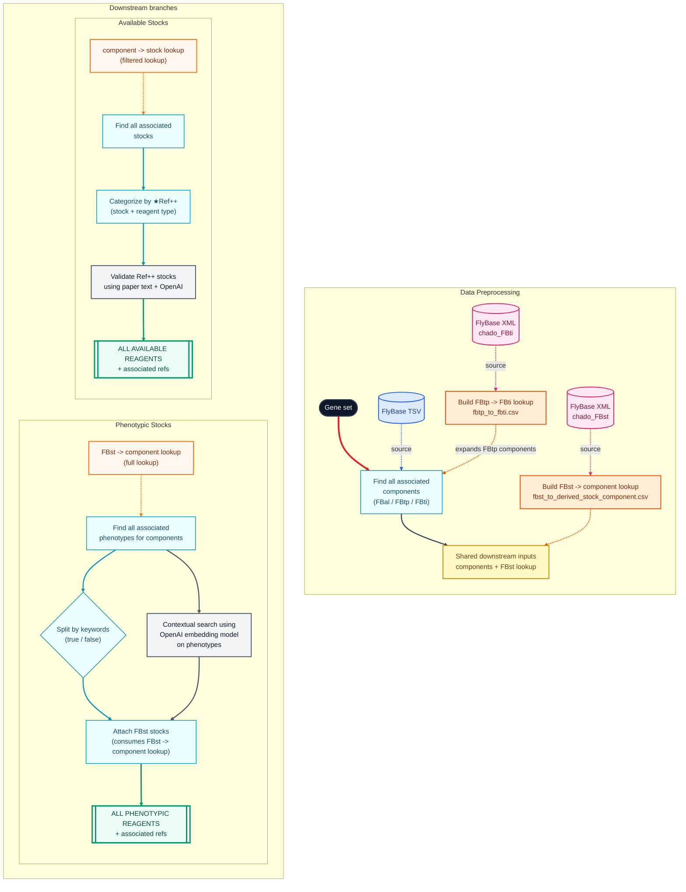
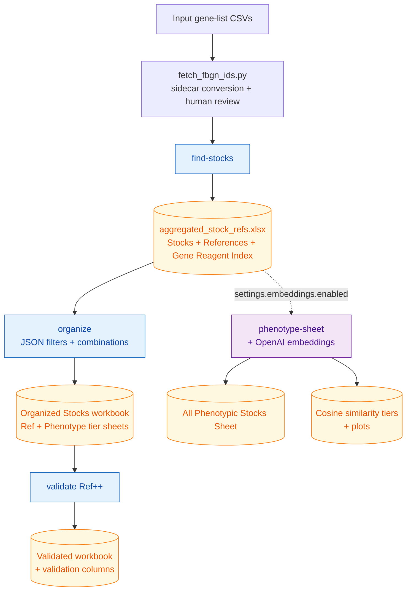
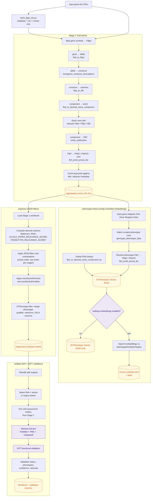

# Pipeline Flowcharts

These flowcharts show the project at two levels:

- the high-level command flow from input gene lists to final workbooks
- the low-level evidence flow that explains where stock references, phenotype references, keyword buckets, and validation decisions come from

## Data flowchart

- ★ `Ref++` = a publication that has a configured keyword in its title or abstract.
- Data Preprocessing turns the input gene set plus FlyBase TSV/XML-derived lookups into the shared component and stock-lookup context used downstream.
- ++Available Stocks++ is the all-stocks path: find associated stocks, categorize by `Ref++` and reagent type, then validate `Ref++` candidates with paper text + OpenAI.
- ++Phenotypic Stocks++ is the phenotype path: find phenotype-associated reagents, split/search those phenotypes, then attach FBst stocks using the full stock-component lookup.

---

## High level technical flowchart

The single public command `run` chains the stages: build the Stage 1 workbook,
organize stocks with the JSON config, validate `Ref++` stocks when enabled, and
run phenotype embeddings when enabled by config. The individual stages remain
available as advanced entry points.

---

## Low level technical flowchart

Each stage is its own subgraph. Within a stage, every step flows top to
bottom. Cross-stage arrows only appear at clear hand-off points
(`Stage 1 → split-stocks`, `Stage 1 → phenotype-sheet`, `split-stocks → validate-stocks`).
FlyBase table names are written into the steps that use them so there are no
shared fan-out edges from a single "Inputs" node.

`*` `PHENOTYPE_RELEVANCE_SCORE` is computed only when a config filter references
it (the `Phenotype++` / `Phenotype+` tiers).

---

## Important Distinction

The pipeline has two separate reference concepts:

- **Stock-level references** come from `entity_publication` and answer: "Which papers are associated with this stock's relevant allele, construct, or insertion components?"
- **Phenotype-sheet references** come from `genotype_phenotype_data.reference` and answer: "Which paper supports this specific curated phenotype row?"

A PMID can appear in Stage 1 but not in the All Phenotypic Stocks Sheet when FlyBase associates the paper with the stock component but does not use that paper as the reference for a curated phenotype row.

---

## All Phenotypic Stocks Sheet is Phenotype-Table-Driven

The All Phenotypic Stocks Sheet is driven by every FBal / FBtp / FBti reagent associated with an input gene (the complete Stage 1 **Gene Reagent Index**), filtered against curated rows in `genotype_phenotype_data`. Stocks are then attached afterward via the full, unfiltered `fbst_to_derived_stock_component.csv`. This means:

- A reagent that has a phenotype row is included regardless of whether any FBst stock was found by Stage 1 stock matching or kept by Stage 2 JSON split limits.
- Every FBst FlyBase associates with a matched reagent surfaces as a Source/ Stock # row, not just the stocks that survived Stage 1 ranking.
- A phenotype-matched reagent with no FBst still produces a "no-stock phenotype reagent" row sourced from the reagent index.
