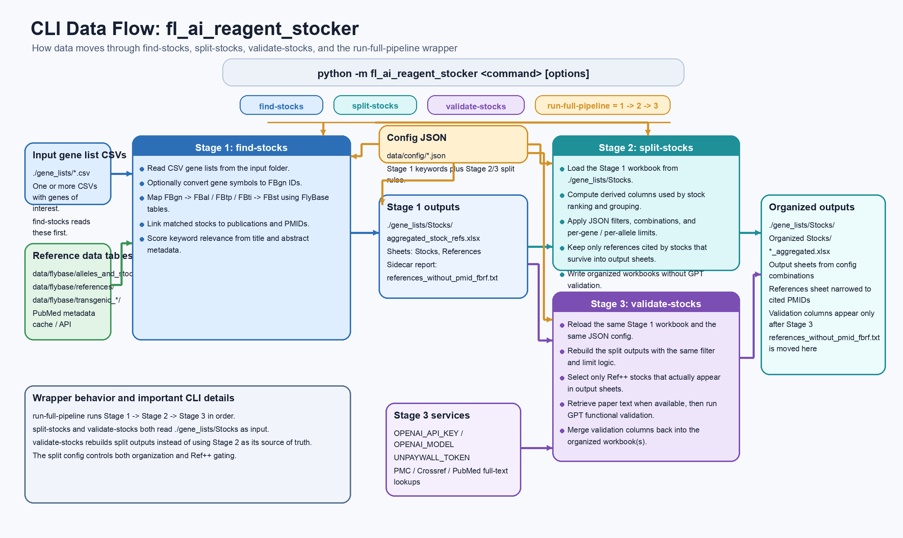

# fl_ai_reagent_stocker: Practical Pipeline Guide

This guide explains how to go from a gene list to a curated set of candidate fly stocks with supporting literature, config-driven sheet organization, and optional AI validation.

## What You Get

After a full run, you will have:

- a stock-level workbook linked to references
- organized output sheets based on your JSON rules
- a reference table narrowed to papers relevant to selected stocks
- optional validation columns for `Ref++` output-sheet stocks

## Visual Overview

### Data Flow



### High-Level Overview


### Rules And Evidence Decisions


## Before You Run

- Run commands from the project directory.
- Install dependencies:

```bash
pip install -r requirements.txt
```

- Put your input CSV files in one folder such as `./gene_lists`.
- Optional environment variables:
  - `OPENAI_API_KEY`
  - `NCBI_API_KEY`
  - `UNPAYWALL_TOKEN`
  - `OPENAI_MODEL`

## 5-Minute Quick Start

### Option A: one command

```bash
python -m fl_ai_reagent_stocker run-full-pipeline ./gene_lists --config ./my_split_config.json --test-log
```

### Option B: three explicit stages

```bash
python -m fl_ai_reagent_stocker find-stocks ./gene_lists
python -m fl_ai_reagent_stocker split-stocks ./gene_lists/Stocks --config ./my_split_config.json
python -m fl_ai_reagent_stocker validate-stocks ./gene_lists/Stocks --config ./my_split_config.json --test-log
```

Default config path:

- `data/config/stock_split_config_example.json`

## Stage 1: Build Stocks + References (`find-stocks`)

This stage reads your gene lists and creates an Excel workbook that links genes, stocks, and publications.

### Command

```bash
python -m fl_ai_reagent_stocker find-stocks ./gene_lists
```

### Main output

- `./gene_lists/Stocks/aggregated_stock_refs.xlsx`

### What Stage 1 does

1. Convert gene symbols to FBgn IDs unless skipped.
2. Build gene -> allele mappings from `fbal_to_fbgn`.
3. Build allele -> construct mappings from `transgenic_construct_descriptions`.
4. Expand construct IDs to insertion IDs through `data/flybase/transgenic_insertions/fbtp_to_fbti.csv`.
5. Match allele, construct, and insertion IDs to stocks via `fbst_to_derived_stock_component.csv`.
6. Link matched components to references and PMIDs.
7. Score title/abstract keyword relevance using `settings.relevantSearchTerms`.

### Common options

- `--config`, `-c`
- `--skip-fbgnid-conversion`
- `--gene-col`
- `--input-gene-col`
- `--batch-size`

## Stage 2: Organize Stocks (`split-stocks`)

This stage takes the Stage 1 workbook, applies your config logic, and writes organized output sheets. It does not run GPT validation.

### Command

```bash
python -m fl_ai_reagent_stocker split-stocks ./gene_lists/Stocks --config ./my_split_config.json
```

### Main output folder

- `./gene_lists/Stocks/Organized Stocks/`

For each input workbook, output is `<input_name>_aggregated.xlsx`.

When `--soft-run --OAI-embedding` are both enabled, the pipeline also writes
`<input_name>_aggregated_similarity_tiers.xlsx`.

### What is inside

- `Contents`
- `Sheet1`, `Sheet2`, ...
- `References`
- `Stock Sheet by Gene`

In `--soft-run` mode, the workbook includes a `Stock Phenotype Sheet` built from `genotype_phenotype_data` instead of GPT validation output.

When `--soft-run --OAI-embedding` are used together, a second workbook is
written with:

- `Contents` as the first tab
- `Gene Set` as the second tab, copied from the input gene-list CSV data when available
- `Stock Phenotype Sheet` as the third tab
- fixed cosine-similarity threshold tabs after it
- tier assignment based on the maximum cosine score across the configured
  phenotype similarity targets
- sheets defined by 0.05 cosine steps from highest to lowest similarity:
  `0.95-1.0`, `0.9-0.95`, ..., with a final `<0.05` bucket
- empty threshold buckets are skipped

This phenotype-similarity embedding path is pinned to the OpenAI embedding
model `text-embedding-3-large`.

When `--soft-run --OAI-embedding --simple-buckets` are used together, the same
workbook switches to rule-based combination tabs instead of cosine-threshold
tiers:

- `Contents` lists one row per `collection/UAS/sleep-circ/balancer` combination
- each row includes `Sheet name`, `# Stocks`, `# Alleles`, and `# Genes`
- one sheet is written for every listed combination, including zero-count rows
- genes, alleles, and reagents are assigned once and are never double-counted
  within or across combinations
- column headers always show all three dimensions:
  - **UAS / non-UAS** — whether the stock genotype contains a UAS construct
  - **slp/ circ / Non slp/ circ** — whether any linked phenotype mentions
    "sleep" or "circadian"
  - **No bal / Has bal** — whether the stock carries at least one balancer
    chromosome
- rows are ordered by collection first, then `UAS=true`, `sleep/circ=true`, and
  `No bal` before `Has bal`

### Common options

- `--config`, `-c`
- `--quiet`, `-q`
- `--soft-run`
- `--OAI-embedding`
- `--simple-buckets`

## Stage 3: Validate Ref++ Stocks (`validate-stocks`)

This stage reruns the same split logic, identifies `Ref++` output-sheet stocks, runs selective validation, and merges validation columns back into the organized workbook.

### Command

```bash
python -m fl_ai_reagent_stocker validate-stocks ./gene_lists/Stocks --config ./my_split_config.json --test-log
```

### Validation rules

Validation is intentionally selective:

1. the stock must survive filter and limit rules into a sheet whose combination includes `Ref++`
2. the reference must be keyword-relevant according to `settings.relevantSearchTerms`
3. full-text and pattern checks must make the pair eligible

Validation short-circuits on the first functional hit per stock.

### Common options

- `--config`, `-c`
- `--quiet`, `-q`
- `--soft-run`
- `--test-log`
- `--max-gpt-calls-per-stock`

## Full Pipeline

Use `run-full-pipeline` when you want Stage 1, Stage 2, and Stage 3 to run in sequence:

```bash
python -m fl_ai_reagent_stocker run-full-pipeline ./gene_lists --config ./my_split_config.json --test-log
```

Output paths stay the same as before:

- Stage 1 workbook: `./gene_lists/Stocks/aggregated_stock_refs.xlsx`
- Organized output directory: `./gene_lists/Stocks/Organized Stocks/`

## Config File Contract

The JSON config files stay in `data/config/` and keep the same effect on stock splitting:

- `settings.relevantSearchTerms` still defines keyword relevance and `Ref++`
- `settings.phenotypeSimilarityTargets` is required for phenotype-sheet cosine similarity targets
- `filters` still defines reusable filter predicates
- `combinations` still defines the sheet partitions
- `filterDescriptions` still defines user-facing explanations
- `maxStocksPerGene` and `maxStocksPerAllele` still define stock limits

Example configs:

- `data/config/stock_split_config_example.json`
- `data/config/stock_split_config_no_bloomington.json`

## Helper Scripts

Canonical helper entry points:

- `scripts/fetch_fbgn_ids.py`
- `scripts/build_fbst_derived_stock_components.py`
- `scripts/build_fbtp_to_fbti_mapping.py`
- `scripts/refresh_flybase_data.py`

## Reliability Notes

- Full-text retrieval uses multiple sources and retries transient failures.
- Stage 1 now supports FBtp -> FBti expansion through the generated mapping CSV.
- Stage 2 and Stage 3 share the same split/filter logic so config behavior stays stable across the refactor.
